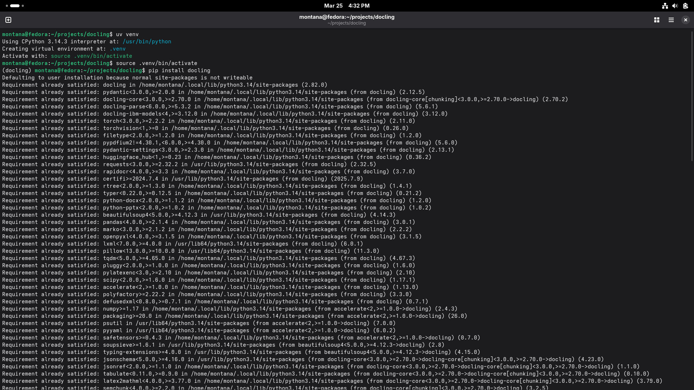
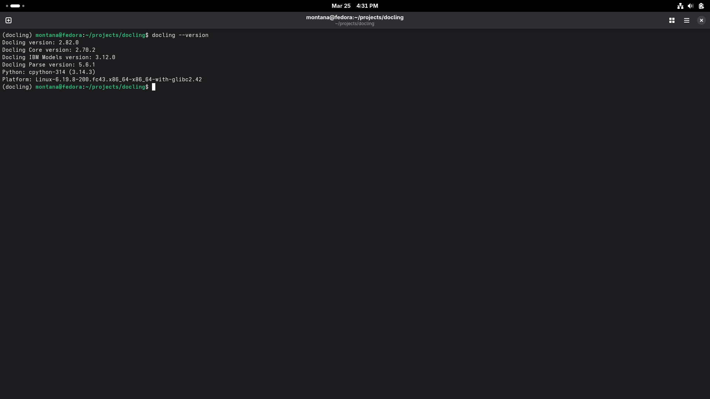
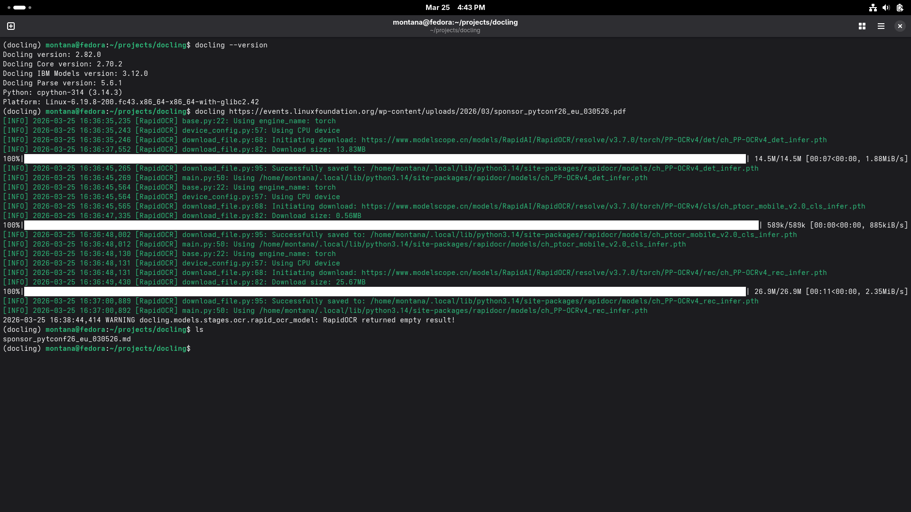
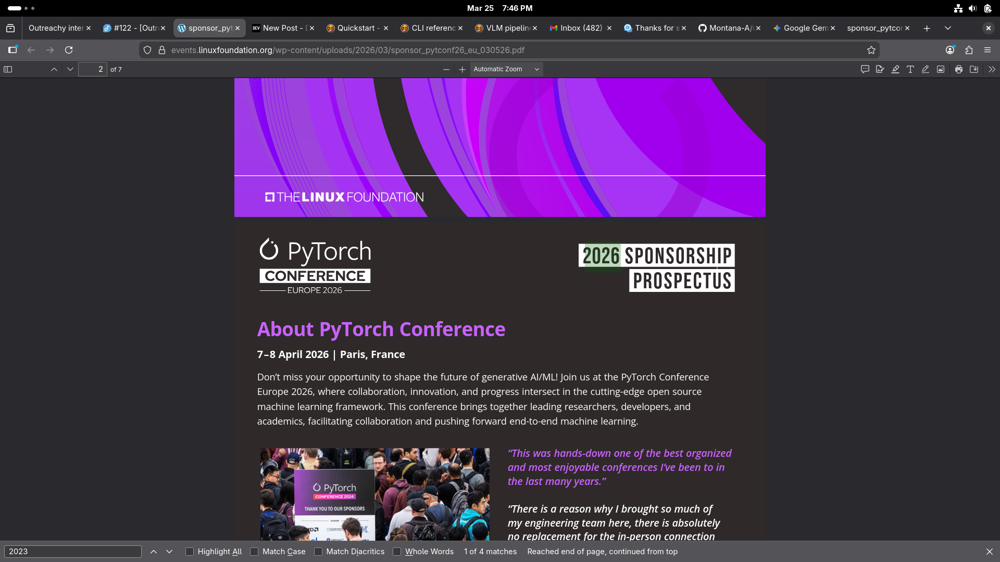
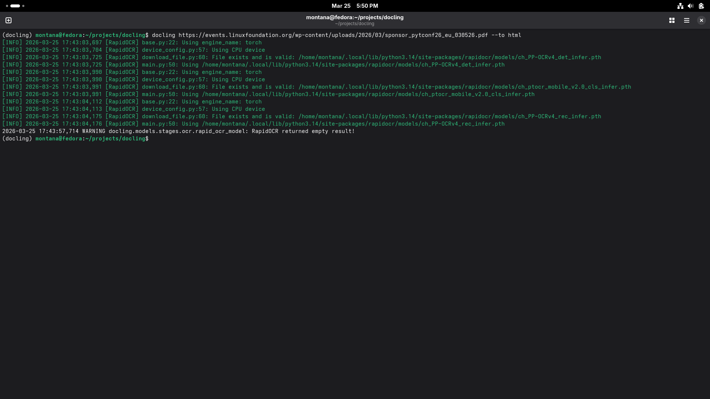
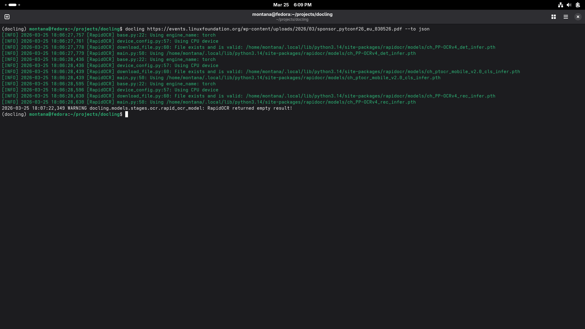
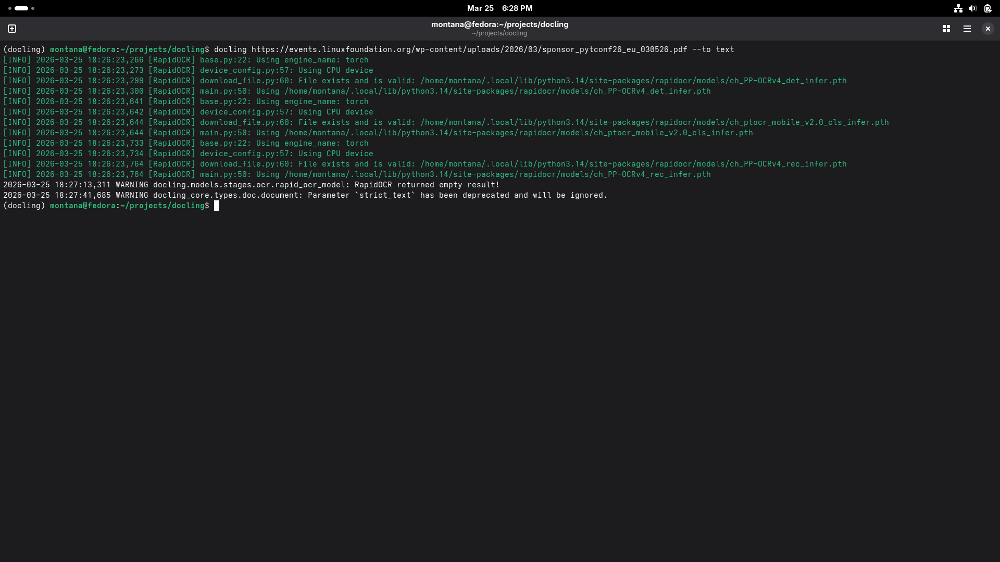
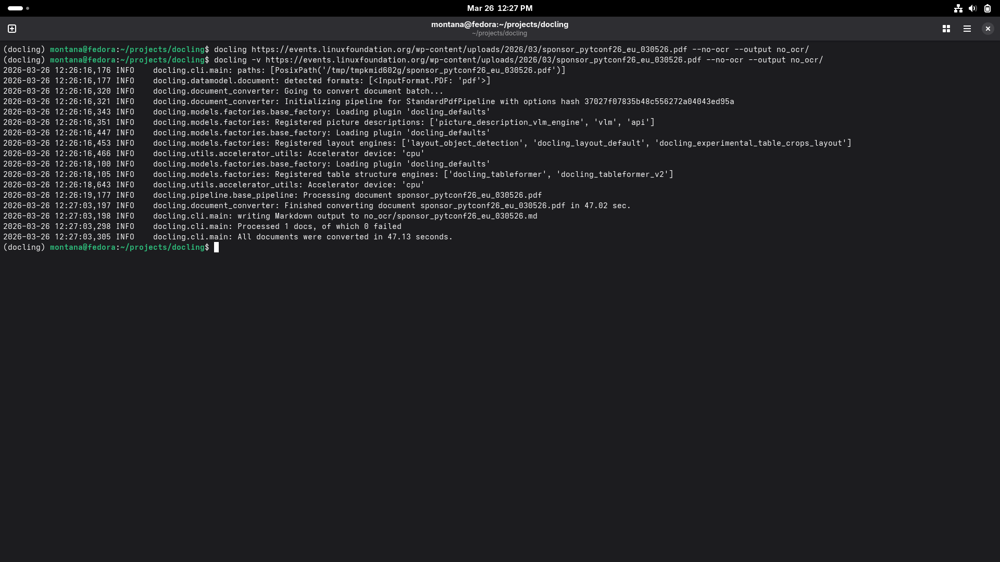
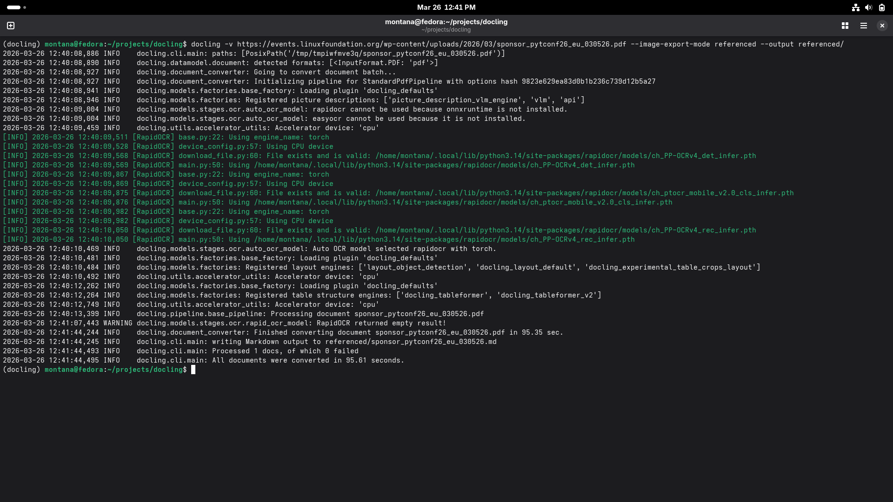
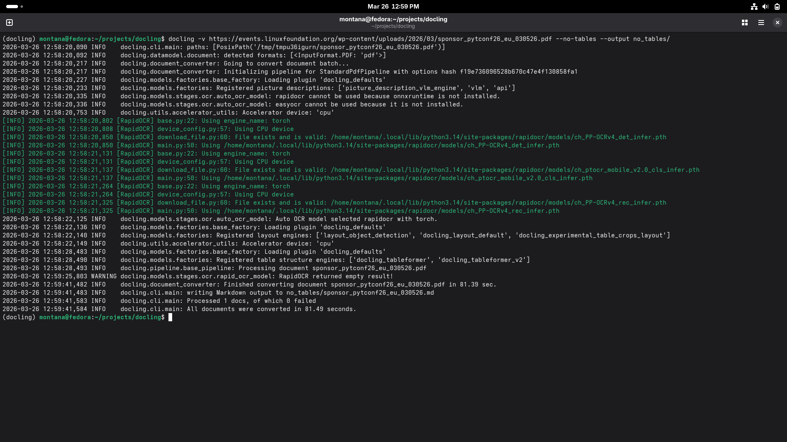

# Docling Document Processing Exploration

## Source Document

- **URL**: https://events.linuxfoundation.org/wp-content/uploads/2026/03/sponsor_pytconf26_eu_030526.pdf

## Step 1: Installation

Set up a virtual environment and install Docling with pip:

```bash
uv venv
source .venv/bin/activate
pip install docling
```

**Output:**


## Step 2: Version Check

Display the installed version of Docling:

```bash
docling --version
```

**Output:**


## Step 3: Default Options Conversion

Convert the PDF using the Docling CLI with default options (outputs Markdown):

```bash
docling https://events.linuxfoundation.org/wp-content/uploads/2026/03/sponsor_pytconf26_eu_030526.pdf
```

**Output File:** [sponsor_pytconf26_eu_030526.md](sponsor_pytconf26_eu_030526.md)
**Terminal Output:**


#### Content Quality

Extracts text with proper structure and reasonable hierarchy. Most images in the document are preserved as base64 data URIs embedded directly in the output.

The cover page is largely image-based with a thin text layer, so only "7–8 April 2026 | Paris, France" is recovered, as that string appears to be the only text embedded within the image itself. Beyond the cover, text extraction is accurate and well-structured wherever a text layer exists.

There is also a text-layering artifact in the source PDF: the label "2023 SPONSORSHIP" is visually hidden behind "2026 SPONSORSHIP" in the rendered document, left over from a prior revision. The standard pipeline surfaces both strings, so both appear in the output.

Table extraction is accurate, including the `✔` symbols used across certain columns. Layout is only partially preserved though: in the "Promotional Marketing Opportunities" section, images that should sit beside their corresponding text are instead stacked above it, with all body text following below.

**PDF search for "2023"**


#### Time
~2 minutes

#### Resources
Minimal

#### Use Case
RAG pipelines, AI training, documentation

## Steps 4 & 5: Alternative Format Conversions

### HTML Format

Convert the PDF to HTML for web rendering:

```bash
docling https://events.linuxfoundation.org/wp-content/uploads/2026/03/sponsor_pytconf26_eu_030526.pdf --to html
```

**Output File:** [sponsor_pytconf26_eu_030526.html](sponsor_pytconf26_eu_030526.html)
**Terminal Output:**


#### Content Quality

HTML is a presentation wrapper around the same underlying extraction as the Markdown output. The base64-embedded images are identical, the missing cover page is still absent, and all text content is the same. The only difference is that web-oriented styling is applied for browser rendering. The output format does not affect what gets extracted, only how it is presented.

#### Time
~2 minutes

#### Resources
Minimal

#### Use Case
Web viewing, reference documents

### JSON Format

Convert the PDF to JSON for structured data access:

```bash
docling https://events.linuxfoundation.org/wp-content/uploads/2026/03/sponsor_pytconf26_eu_030526.pdf --to json
```

**Output File:** [sponsor_pytconf26_eu_030526.json](sponsor_pytconf26_eu_030526.json)
**Terminal Output:**


#### Content Quality

The underlying extraction is identical to the Markdown and HTML outputs, same text content, same base64-embedded images, same missing cover page. JSON adds semantic metadata and a structured layout around the content, making it more suitable for programmatic access and downstream processing.

#### Time
~2 minutes

#### Resources
Minimal

#### Use Case
Data pipelines, programmatic processing, automation

### Plain Text Format

Convert the PDF to plain text:

```bash
docling https://events.linuxfoundation.org/wp-content/uploads/2026/03/sponsor_pytconf26_eu_030526.pdf --to text
```

**Output File:** [sponsor_pytconf26_eu_030526.txt](sponsor_pytconf26_eu_030526.txt)
**Terminal Output:**


#### Content Quality

The underlying extraction is identical to the Markdown output, but all images are replaced with `<!-- image -->` placeholders instead of being embedded as base64, and all structure and metadata are stripped. Useful only when the raw text is all that matters and everything else can be discarded.

#### Time
~2 minutes

#### Resources
Minimal

#### Use Case
Archival

## Advanced: 

### VLM Pipeline

Test the VLM (Vision Language Model) pipeline using the Granite Docling model:

```bash
docling --pipeline vlm --vlm-model granite_docling https://events.linuxfoundation.org/wp-content/uploads/2026/03/sponsor_pytconf26_eu_030526.pdf --output vlm/
```

**Output File:** [vlm/sponsor_pytconf26_eu_030526.md](vlm/sponsor_pytconf26_eu_030526.md)

#### Content Quality

Produces 980 lines of output, roughly 3.5x more than the default pipeline, because the model processes the document visually rather than relying solely on the text layer. This recovers the cover page that the standard pipeline missed, and eliminates the "2023 SPONSORSHIP" artifact since the model reads the visual rendering of the page rather than the hidden text layer beneath it. Layout understanding and structural recognition are both noticeably better throughout the document.

The VLM pipeline does introduce its own issues though. The `✔` symbols in the sponsorship table that the standard pipeline captures correctly are replaced with the text "(in-place)", losing the original meaning. The output also contains significant textual repetition, where passages and labels appear multiple times in the output despite appearing only once in the source document.

Despite having more lines, the output file is smaller than the standard pipeline's output. Images are still embedded as base64, consistent with all other output formats.

#### Time
~45 minutes

#### Resources
High (CPU and memory).

#### Use Case
Complex documents requiring maximum extraction fidelity

### OCR Disabled

Convert the PDF with OCR explicitly disabled:

```bash
docling -v https://events.linuxfoundation.org/wp-content/uploads/2026/03/sponsor_pytconf26_eu_030526.pdf --no-ocr --output no_ocr/
```

**Output File:** [no_ocr/sponsor_pytconf26_eu_030526.md](no_ocr/sponsor_pytconf26_eu_030526.md)
**Terminal Output:**


#### Content Quality

Output is identical to the default conversion. Since this PDF has a text layer throughout, disabling OCR has no effect. 

#### Time
~1 minutes

#### Resources
Minimal

#### Use Case
__

### Referenced Image Export

Convert the PDF with images exported as separate files instead of embedded base64:

```bash
docling -v https://events.linuxfoundation.org/wp-content/uploads/2026/03/sponsor_pytconf26_eu_030526.pdf --image-export-mode referenced --output referenced/
```

**Output File:** [referenced/sponsor_pytconf26_eu_030526.md](referenced/sponsor_pytconf26_eu_030526.md)
**Terminal Output:**


#### Content Quality

The text content and structure are identical to the default output, with the only difference being that images are written as separate files and referenced by path in the Markdown rather than embedded as base64.

#### Time
~2 minutes

#### Resources
Minimal

#### Use Case
Pipelines where images need to be accessed or processed separately, or where a smaller, cleaner output file is preferred over large base64-embedded content

### Table Structure Disabled

Convert the PDF with table structure recovery disabled:

```bash
docling -v https://events.linuxfoundation.org/wp-content/uploads/2026/03/sponsor_pytconf26_eu_030526.pdf --no-tables --output no_tables/
```

**Output File:** [no_tables/sponsor_pytconf26_eu_030526.md](no_tables/sponsor_pytconf26_eu_030526.md)
**Terminal Output:**


#### Content Quality

Identical to the default output. The only difference is in how the sponsorship table is rendered: instead of a structured Markdown table with rows and columns, all the table content is collapsed into a single cell.

#### Time
~2 minutes

#### Resources
Minimal

#### Use Case
__
